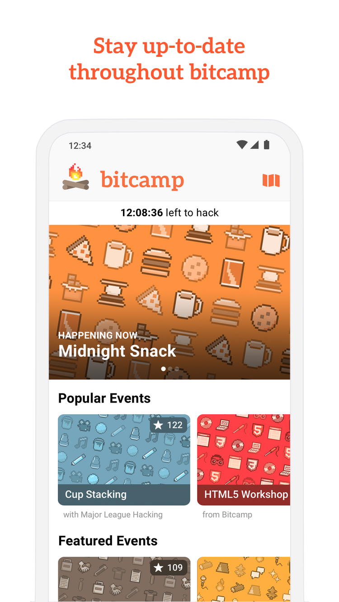

# :fire: Bitcamp Mobile App
<p align="center"></p>

This is the the cross-platform mobile app for Bitcamp's hackathon, which is built using React Native and Expo. It provides hackers with up-to-date schedule information, custom QR codes, event notifications, and more.

## :round_pushpin: Quick Start
1. Install [node.js](https://nodejs.org/en/) and [git](https://git-scm.com/)
2. Install [yarn](https://yarnpkg.com/en/docs/install)
3. Globally install [expo-cli](https://docs.expo.io/versions/latest/get-started/installation/)
   - Optionally create an [expo account](https://expo.io/), and download the [expo mobile app](https://expo.io/tools#client) so you can run the app on your mobile device
4. Clone the repository using `git clone https://github.com/bitcamp/mobile-app.git`
5. Download the dependencies using `yarn install`
6. Create a configuration file called `config.js` at the root of the repository with all of your API keys. The file should look something like this:
```js
export const firebaseConfig = {
  apiKey: "YOUR API KEY",
  authDomain: "YOUR AUTH DOMAIN",
  databaseURL: "YOUR DB URL",
  storageBucket: "YOUR STORAGE BUCKET"
};
```
7. Run the app using `expo start` or `yarn start`

## :man_technologist: Contribution Guide
We follow the [GitHub flow](https://guides.github.com/introduction/flow/) for managing this repository, which means that each new feature gets a branch off of master.
### Step-by-Step Instructions
1. To make a new branch off of master, run
```bash
$ git checkout -b <descriptive-branch-name>
```
2. Add commits using descriptive commit messages
3. Push your new branch to the repository
4. Submit a merge request on GitHub when your feature is ready for review

### FAQ
Here are some common development questions
 * How do I pull down new changes from master into a local branch?
```bash
 $ git pull origin master
```
